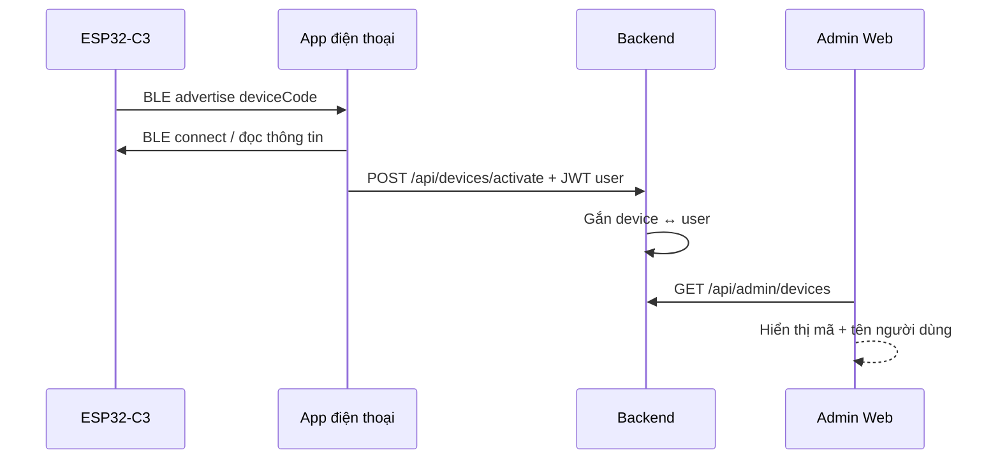

# Hệ thống giám sát sức khỏe — Admin + IoT

Monorepo cho **web admin**, **API backend**, tích hợp **ESP32-C3** (BLE) và **app điện thoại**.

## Tính năng

| Tính năng | Mô tả |
|-----------|--------|
| Kích hoạt thiết bị | App BLE → API xác nhận `deviceCode` + người dùng |
| Dashboard | Đếm tổng vòng tay, người dùng, thiết bị lỗi |
| Giám sát | Danh sách thiết bị, map user ↔ device, mã lỗi |
| OTA từ xa | Upload `.bin`, tạo campaign, rollout hàng loạt |

## Cấu trúc

```
IOT/
├── backend/      # API Node.js + Prisma (SQLite)
├── admin-web/    # React admin dashboard
├── firmware/     # Gợi ý code ESP32-C3 (PlatformIO)
└── docs/         # Kiến trúc & API cho app mobile
```

## Chạy nhanh

```bash
# Cài dependency
npm install

# Tạo DB + dữ liệu mẫu
npm run db:push
npm run db:seed

# Chạy API + web (2 terminal hoặc 1 lệnh)
npm run dev
```

- **Admin web:** http://localhost:3000  
- **API:** http://localhost:4000  

**Đăng nhập admin mặc định:** `admin@health.local` / `admin123`

## Luồng kích hoạt vòng tay



## API chính (app mobile)

```http
POST /api/auth/login
POST /api/devices/activate
Authorization: Bearer <token>
Body: { "deviceCode": "C3-A1B2C3...", "firmwareVersion": "1.0.0" }

POST /api/devices/:deviceCode/heartbeat
Body: { "heartRate": 72, "battery": 85, "errorCodes": ["E_SENSOR_HR"] }

GET /api/devices/:deviceCode/firmware/check
```

Chi tiết: [docs/API.md](docs/API.md)

## OTA (sửa lỗi từ xa)

1. Admin upload file `.bin` trên web (menu OTA)
2. Tạo campaign — có thể lọc theo mã lỗi (vd `E_SENSOR_HR`)
3. **Bắt đầu rollout** → thiết bị gọi `firmware/check` nhận URL tải
4. ESP32 flash OTA và báo `POST .../ota/report`

## Bước tiếp theo

- [ ] App Flutter/React Native (BLE + gọi API)
- [ ] Firmware ESP32-C3 (GATT + HTTPS OTA)
- [ ] Deploy production (PostgreSQL, HTTPS, S3 cho firmware)
